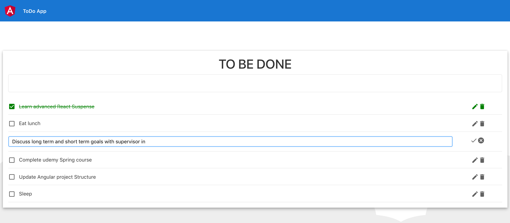

# ng-spring-todoapp
# FE Angular ToDo client App and Java Spring backend app
- The frontend application (client) hosts the angular front end code.
- The backend application (server) hosts the java backend end code.

## Getting stated

# FE
The following installations are prerequisits for running and installing the app:
- *[Node](https://nodejs.org/en/download/)
- *[Npm](https://nodejs.org/en/download/)

## Installation and run
``` bash
$ npm install -g @angular/cli
$ npm install 
$ ng serve
$ browser: open http://localhost:4200
$ Your frontend is up!
```

# BE
- 1) Terminal : *[Maven] : Install Maven via Homebrew -> go to server dir -> mvn spring-boot:run
- 2) You can also use Intellij/eclipse to run the project
- 3) Server will be running on http://localhost:8081 by default. This can be updated in application.properties file

# Client APP UI 
<p>Adding a Todo</p>

<p>Editing a To Do</p>

<p>Mark a Todo as Complete</p>

<p>Deleted a Todo</p>


# Backend Request/Response for CRUD
<p>Adding a Todo</p>

<p>Getting all To Dos</p>

<p>Updating a Todo by Id</p>

<p>Deleted a Todo by Id</p>


